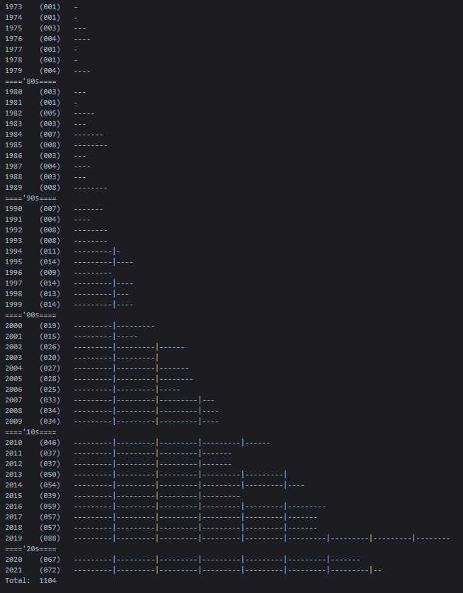

# Ruby Letterboxd Film Scrapper
 A Letterboxd scrapper written in Ruby that gets the year of release of a user's watched films or diary logs, and creates a simple graph with them.

 For a quick start check main.rb

## Screenshots

